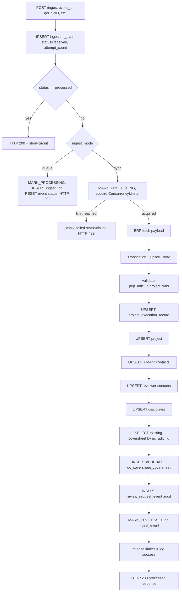

## Order of Operations After an Initial Ingest POST

This file describes the database and control-flow updates that run the first time a POST **/ingest** arrives (assuming the event has never been processed before and the service is running in `sync` mode).

1. **Pre-flight** – the router forwards the payload and metadata into `IngestService.handle_ingest`. The service calls `UPSERT_INGEST_EVENT_SQL`, which inserts (or updates) the row in `qc_coversheet.ingest_event` with `status='received'` and `attempt_count`, capturing the delivery timestamps and correlation ID.
2. **Short-circuit checks** – if the row already reported `status='processed'`, the handler returns immediately with HTTP 200. Otherwise:
   - When `settings.ingest_mode == "queue"`, the handler marks the event as `processing`, upserts `qc_coversheet.ingest_job` (queued state with `latest_event_id`), resets the event status to `received`, and returns HTTP 202.
   - In `sync` mode, it marks the `ingest_event` as `processing`, then tries to acquire a `ConcurrencyLimiter` slot. Failing the limit updates the event with `status='failed'` and returns HTTP 429.
3. **ERP fetch + state upsert** – once permitted, the handler fetches the QC payload from the ERP client and opens a transactional block that executes `_upsert_state`:
   - Validates `pep_udic_id` and `project_wbs`.
   - Upserts `qc_coversheet.project_execution_record` with the ERP payload, creating the `project_execution_record_id`.
   - Upserts `qc_coversheet.project`, capturing the latest metadata for the WBS.
   - Upserts PM/PP contacts into `qc_coversheet.contact`, preferring `pmID`/`ppID` as `erp_contact_id` and falling back to `EMAIL:<email>` when needed; emails are normalized to lowercase and display names updated. Gresham Smith emails (`@greshamsmith.com` or `@gspnet.com`) force `erp_company_name="Gresham Smith"` and clear `company_erp_id`.
   - Upserts reviewer contacts from `reviewerData` using `reviewerID` (or email fallback) and stores `reviewerCompanyID`/`reviewerCompany` into `company_erp_id`/`erp_company_name`.
   - Inserts each discipline (`qc_coversheet.discipline`) referenced in the payload, forcing codes to uppercase and marking them `active`.
   - Selects the most recent coversheet by `qc_coversheet_udic_id` and either updates it or inserts a new row in `qc_coversheet.qc_coversheet_coversheet`, wiring in the execution record, project, PM/PP info, dates, and snapshots (including `client_id_snapshot` from `clientNameID`).
4. **Post-upsert bookkeeping** – still inside the transaction, the handler inserts a `qc_coversheet.review_request_event` audit record (if a review request exists for the coversheet) and updates `qc_coversheet.ingest_event` to `status='processed'`.
5. **Response and cleanup** – after releasing the `ConcurrencyLimiter`, the handler logs success and returns HTTP 200 with the processed status.

